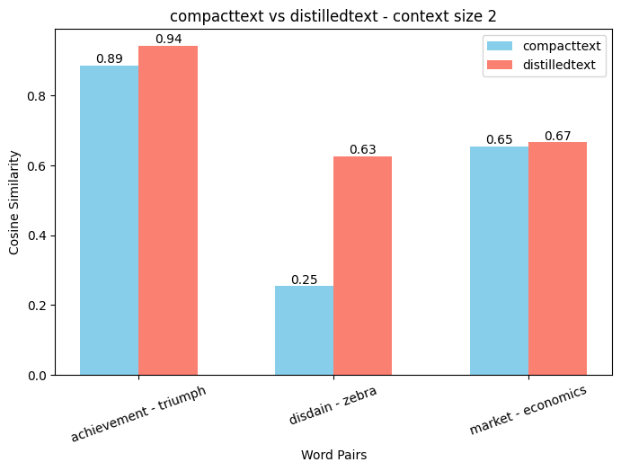
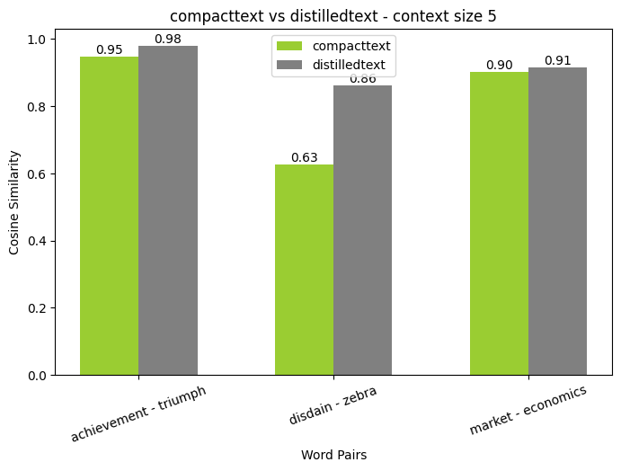
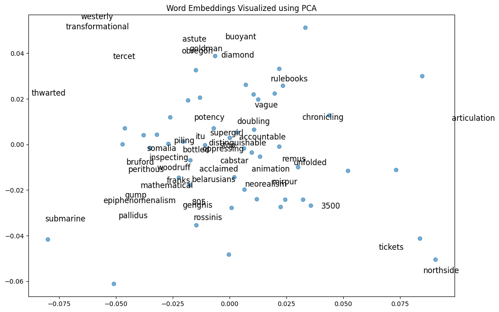
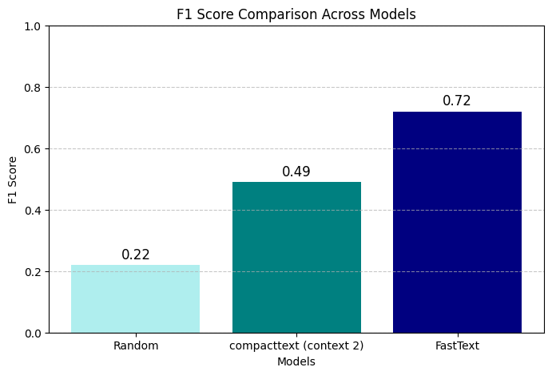
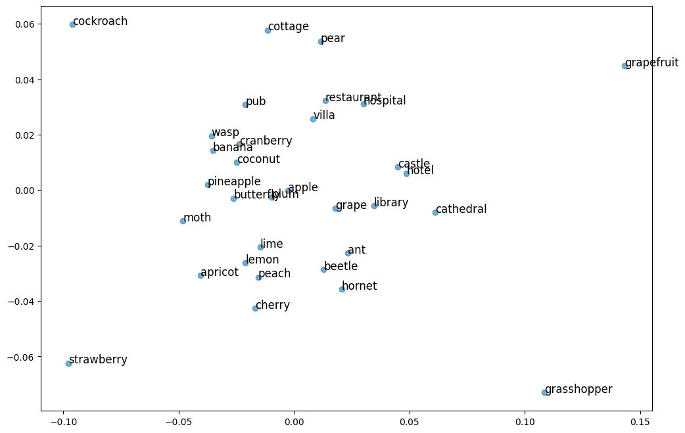
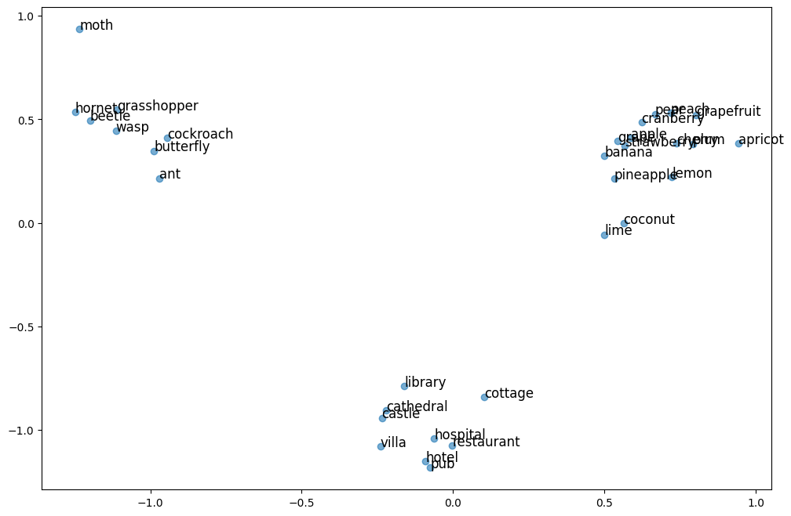
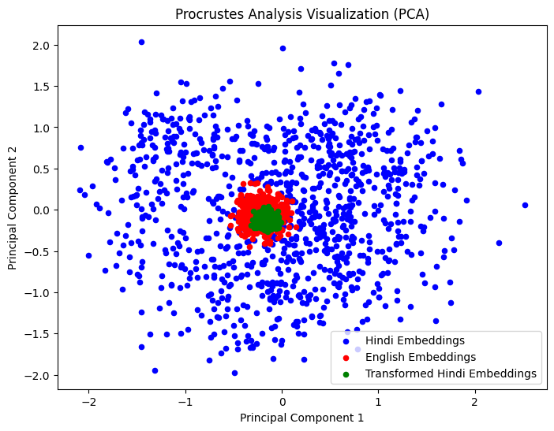
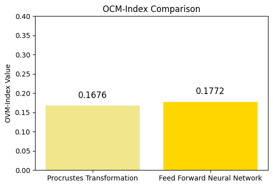

<h1 style="text-align: center;">
Precog Assignment: February 2025
</h1>
<p style="text-align: center;"><i>Ojasva Saxena</i></p>

---

## Task : Language Representations

>**Say why language representations I have chosen ...**


### Project Directory Structure

📂 **Language-Representations**
├── 📂 **Corpora** *[corpora for P1, and alignment dictionary for P2]*
│   ├── 📄 **bilingual_dict_chatgpt.csv**
│   ├── 📄 **bilingual_prompt_en_hi.txt**
│   └── 📄 **eng_wiki_corpora.txt**
├── 📂 **Evals** *[BLESS concept categorization eval dataset]*
│   └── 📄 **bless_concept.json**
├── 📂 **Images** *[images used throughout README]*
├── 📄 **precog_utils.py** *[common functions used though P1, P2, Bonus]*
├── 📄 **co_occurrence_embeddings.ipynb** *[P1 code]*
├── 📄 **cross_lingual_alignment.ipynb** *[P2 code]*
├── 📄 **caste_bias.ipynb** *[Bonus Task code]*
└── 📄 **README .md** *[consists of the motivation, directory structure and entire report/documentation through P1, P2, P3, Bonus]*

---
### Part 1 : Creating and Analysing Word Embeddings
I explore generation of dense word representations from an English corpora. The dataset used is the [English-Wiki-2016 dataset](https://wortschatz.uni-leipzig.de/en/download/English) (300K sentences). The idea is that dense vector representations (embeddings) should somehow capture the semantic interpretations of words in a vector space which is computationally efficient.
I will also be evaluating the embeddings I create using an intrinsic evaluation task i.e. Analogy Test. I will also run the same evaluations for a state-of-the-art embedding representation, FastText. This will help me assess the quality of my embeddings.

**Sample Raw Dataset Rows**
```
...
251419  These stars energize a superbubble about 1200 lys across which is observed in the visual (Hα) and X-ray portions of the spectrum.
251420  These statements from Catholic officials signal a shift away from a “hard” supersessionist model of displacement.
251421  These statements preceded the first law of thermodynamics (1845) and helped in its formulation.
251422  These states along with Himachal Pradesh, Uttarakhand, and Sikkim lie mostly in the Himalayan region.
...
```
**Some observations :**
* All sentences are indexed with a serial number which we will have to remove while cleaning the corpus.
* There are some special characters dispersed throughout the corpus, which do not require to be embedded, as our evaluations will mostly focus on semantic understanding.
* Each sentence is ~12-17 sentences long, so this would have to be kept in mind while setting the context window. A small context window could be ~2 words. A good sized context window shall be ~5 words.
* As some words (like proper nouns) appear very rarely, they might increase my vocabulary size too much without adding a of value, and becoming an unnecessary performance bottleneck. I will need to address this issue by handling `<UNK>` tokens into my vocabulary.

#### Co-Occurrence Matrix
* A co-occurrence matrix was constructed based on how frequently pairs of words appear together in a context window.
* A few experiments were carried out for threshholding as well - when to keep/remove tokens in the vocabulary. Note that removing tokens referes to treating them as `<UNK>`. The trade-off with threshholding is vocabulary size (computational expense) vs inference on diverse corpora. I found that `vocab_threshold=3` did not reduce vocab size too much, and also `<UNK>` turned out to be less frequent (although it was still pretty frequent).
* Here are the most common words in the dataset after processing and 3-threshholding:
```
Most Common Words:  [('the', 444265), ('of', 213856), ('and', 173917), ('<UNK>', 164394), ('to', 156518), ('in', 154961), ('a', 135257), ('is', 69267), ('was', 58467), ('for', 53660)]
```
* The vocabulary size after cleaning and threshholding is found to be ~65k tokens across the 300K sentence corpus.
* As each sentence is ~12-17 sentences long, ***Short Context Length = 2 (computationally cheap)*** , ***Good Context Length = 5 (computationally efficient)***. A longer context length (~8-10) might be even better, but computationally expensive. I have analysed context windows of 2 words and 5 words for this project.

**Probability Matrix**
* I converted the co-occurrence matrix to a probability matrix by dividing each row with it's sum.
* Conversion to a probability distribution is like a normalization step which helps in reducing the bias towards frequent words and having consistent absolute values.
* This improves the overall quality of the embeddings.

#### Dimensionality Reduction
The rows of our `65k x 65k` co-occurrence matrix are essentially the embeddings for each word corresponding to the row. The issue is that is matrix is sparse (lots of zeros) and very huge, making working with it compute intensive.

**TruncatedSVD for Dimensionality Reduction**

To work around this, I used TruncatedSVD, which is an appoximation based on Singular Value Decomposition of a matrix. TruncatedSVD captures the importance/weights (singualar values) of each column (feature), and removes the nearly redundant dimensions. This reduces the dimensions of the matrix without losing much information.
Co-occurrence matries are sparse matrices, owing to the fact that most words usually don't come in the same context as a lot of vocabulary words, rendering most counts as be 0.
TruncatedSVD is a great way to create dense embeddings from sparese ones, and remove redundancy in the co-occurrence matrix. Using TruncatedSVD, I can convert my `VxV` dimensional vector space to a `Vxd` dimensional space, where `d` is the reduced dimension.

**Getting COMPACT and DISTILLED embeddings using TruncatedSVD**
* I  attempted to analyse the variance while reducing dimensions. The idea retain most of the variance while reducing dimensions, which essentially correlates to the information contained in the matrix. Usually, retaining *>90%* of the variance is good enough. As a `65k x 65k` matrix is too huge to optimize on TruncatedSVD hyperparameters (dimensions), I used trial and error to create 2 matrices: Compact Embedding (~250 dimensions) and Distilled Embedding (10 dimensions). I have intentionally chosen to create 10-dimensional embeddings in order to assess the extent of information loss as compared to higher dimensional models.
* Compact embedding length: `sqrt(V)` (new marix size `V x sqrt(V)`) ***(`sqrt(v)` is a common heuristic)***. This creates ~250 dimensional embeddings for all vocabulary words.
* Distilled embedding length: 10 (new marix size `Vx10`). This creates ~250 dimensional embeddings for all vocabulary words.
* For convenience, let's call these resulting embeddings **compacttext** and **distilledtext**.
* To compare my embedding models, I will use FastText. More on FastText in below.

| | compacttext | distilledtext | FastText |
| -- | -- | -- | -- |
| Vocab Size | 64.8k | 64.8k | 1000k |
| Dimensions | 254 | 10 | 300 |
| Context Window | 2,5 | 2,5 | ~5 | 


#### Evaluation: compacttext vs distilledtext vs FastText

##### Manual Assessment
**Similarity Scores**
* Let's see how our embeddings (over various context lengths and embedding dimensions) for some words:
  * > **achievement** and **triumph** - similar words, high similarity expected
  * > **disdain** and **zebra** - unrelated words, low similarity expected
  * > **market** and **economics** - related words, high similarity expected
  * *Note the difference between ***similar*** and ***related*** words.*





* Both embedding models agree on the most part, but it seems like distilledtext is less confident about non-related words. This is possible due to the information loss during TruncatedSVD. distilledtext might also overestimate similarities between related words due to the same reason.

**Visualizing Embeddings using PCA**
* Reduced the embeddings for compacttext to 2 dimensions and visualizing them on the X-Y axis:


##### Intrinsic Evaluation
I'll be using **FastText** - a state-of-the-art neural embedding model created by Facebook for ~200 languages. FastText is a pre-trained word embedding model learned on different sources using a deep neural network. It's an open-source and the English dataset is publicly available [here](https://fasttext.cc/docs/en/english-vectors.html).

###### BATS (The Bigger Analogy Test Set)
* Sample rows - BATS 
```
{
stem : ['newton', 'scientist'],
choices : [
    ['fox', 'howl'],
    ['caesar', 'emperor'],
    ['aristotle', 'raphael'],
    ['andersen', 'wittgenstein']
    ]
answer : 1
}
```

* All generated embeddings are able to beat random predictions (~2x better performance).
* **`F1 Score (random predictions) = 0.22`**
* **`F1 Score (compacttext (context 2)) = 0.49`**
* **`F1 Score (FastText) = 0.72`**
* Interestingly, compacttext (context 2) performs slightly better than compacttext (context 5) (F1 score 0.45).
* I also notice distilledtext somehow performs almost similar to compacttext. It is interesting to think through why this may be:
  * The top 10 components (weights) after SVD may still be preserved in distilled text. It's possible that due to the relatively small corpus size, 10 latent features might be able to retain a significant portion of the information.
  * Even if there was information loss, it could be positively affecting accuracy as the embeddings are able to generalize better - maybe more abstract relationships between words can be explored in a smaller vector space.
  * BATS is a relatively simple test, containing common words - not requiring a deep and nuanced semantic understanding - resulting in similar performance across high and low dimensions.
* So, I'll use compacttext (context 2) as my best model to compare against FastText.
* compacttext beats random predictions, but is still performs worse than FastText.

###### Concept Categorization (BLESS Datasets)
* Sample Rows - BLESS
```
cluster_label = 'fruit'
words = [
            'apple', 'apricot',
            'banana', 'cherry',
            'coconut', 'cranberry',
            'grapefruit', 'grape',
            'lemon', 'lime',
            'peach', 'pear',
            'pineapple', 'plum',
            'strawberry'
        ]
```
* The **Silhouette Score** is a metric to gauge how good the clustering in the vector space is. The metric scores embeddings based on: closeness of points in a cluster and the nearness of clusters to each other. The Silhouette Score is a value between -1 and 1, with higher scores indicating well-defined clusters with good separation.
* **`Silhouette Score (compacttext (context 2)) = -0.138`**
* **`Silhouette Score (FastText) = 0.066`**

<p style="text-align: center;"><i>Clustering - compacttext (context 2)</i></p>


* I've used the compacttext (context 2) as my embeddings as it performed the best in the Analogy Test. While visualizing the spread, I am able to see that my data points are not very well separated and are hence assigned a negative score. This shows poor semantic understanding and comparative abilities of compacttext.

<p style="text-align: center;"><i>Clustering - FastText</i></p>


* While visualizing the spread for FastText embeddings, I see a clear separation between words belonging to different categories. Hence, FastText is assigned a comparatively higher score.

###### Proposed Metric: Semantic Scatter Score (SSS)
```math
SSS = \frac{e^{\left(\left(f+1\right)\cdot\left(s+2\right)\right)}}{\sqrt[4]{v}}
```
```math
{where,}
```
```math
f = \text{F1 score on the analogy task}
```
```math
s = \text{Silhouette score on the concept categorization task}
```
```math
v = \text{Vocabulary length of the embeddings}
```
* I came up with this metric with the ideas being:
  * Exponentially rewarding F1 score and Silhouette score.
  * As minimum F1 score is 0, and minimum Silhouette score is -1, we add 1 to f and 2 to s, so their values are always >= 1.
  * Penalizing vocabulary size, as it directly affects computation and training efficiency. The fractional exponent (fourth root) means the penalty is less severe. This is because an extremely large vocabulary might not be that bad if the F1 score and Silhouette scores are good.
* I tried estimating what a good Semantic Scatter Score looks like:
  * For `F1 score = 0.70`, `Silhouette score = 0.3`, `Vocabulary Size = 500k`, we get **`SSS (good) = 1.877`**
* Also estimating a sub-optimal Semantic Scatter Score looks like:
  * For `F1 score = 0.30`, `Silhouette score = -0.3`, `Vocabulary Size = 500k`, we get **`SSS (bad) = 0.513`**
* So, higher scores indicate a good performance on intrinsic tasks (analogy and concept clustering), while lower scores 
* Now applying the formula my embeddings as compared to FastText.
* **`Semantic Scatter Score (compacttext (context 2)) = 1.005`**
* **`Semantic Scatter Score (FastText) = 1.105`**

As expected, compacttext performs worse than FastText. Still there is only a slight difference in the SSS scores for both, which is a little unexpected. I'll try to explore why this could be happening:
* compacttext vocabulary size is very small as compared to FastText, causing compacttext to be penalized less.
* The intrinsic evaluations I performed require a fairly basic semantic understanding of common words.
* Even though it was evident that FastText clusters were better, there was not a very significant difference between Silhouette scores.

---

### Part 2 : Cross-Lingual Alignment

Word embeddings essentially exist in the same vector space (provided they are of equal dimensions). I downloaded FastText English and FastTest Hindi pre-trained Wiki word vectors (embeddings) from the [official website](https://fasttext.cc/docs/en/pretrained-vectors.html). Both sets of embeddings have 300 dimensions. Hence, all these combined word vectors exist in the same 300-dimensional space. But, as English and Hindi embeddings were trained separately across a linguistically varied corpora, English words may not be closer to their corresponding Hindi translations.

What alignment does is try to find a transformation (a combination of rotation, translation, scaling) which will ***semantcally synchronize*** or ***ALIGN*** these 2 sets of word embeddings. At first it sounds magical, language translations being nothing but a simple matrix multiplication operation! However, it makes more sense when I realize that Hindi embeddings also exist in a spatially and semantically sound manner -- just like English embeddings. So, if `paper` and `documents` exist around each other, `कागज़` and `दस्तावेज़` also exist around each other in the same vector space; but in different regions. What an ideal alignment does is find a transformation for `कागज़` and `दस्तावेज़` so their transformed vectors now lie near `paper` and `documents`. To learn this transformation, we reaquire a small set of corresponding Hindi and English words to "learn" the transformation.
This enables cross-lingual knowledge transfer, where we can relate words and ideas together across languages.

I will be experimenting with 2 methods for aligning Hindi words to English.
* **Procrustes Analysis (Linear Transformation)**
* **Feed Forward Neural Network (Learned Complex Transformation)**

#### Bilingual Dictionary
As I could not find a suitable bilingual Hindi-English dictionary online, I decided to create my own. Here are the steps I followed:
* Take a sample ~4500 words from the Hindi FastText word vectors.
* In chunks of 200, pass the words to ChatGPT with a prompt to generate a csv-like bilingual dictionary. I spent a considerable amount of time prompt-engineering this step. It's a cruical as a good quality training data can do wonders for learning the tranformations in this case.
* The prompt is present inside: `Corpora/bilingual_prompt_en_hi.txt`. I have engineered a set of rules which gave me embeddings which look like this: (excerpt from `Corpora/bilingual_dict_chatgpt.csv`)
```
...
सिनई,Sinai
निथार,filtration
श्रेष्ट,best
५८००,5800
गुटबाजी,factionalism
वैष्णवन,Vaishnavan
स्टीफेंस,Stephens
लोडिंग,loading
एनिमे,anime
कौम्ब,Comb
मावा,mawa
भू,earth
...
```
* This bilingual dictionary will be used to Train and Evaluate the alignment methodology.
* Out of the 4,478 entries in the bilingual dictionary, 90% are used for traiing and 10% will be used for evaluation purposes. 

#### Procrustes Analysis
* Using the bilingual dictionary and FastText Embeddings (English and Hindi) I create matrices `X` (Hindi Embeddings) and `Y` (English Embeddings). Each row of X and Y corresponds to a Hindi and English word vector respectively. The size of `X` and `Y` is equal to the bilingual dictionary. `X` and `Y` are my parallel word embedding matrices.
* Procrustes Analysis involves calculating a Linear Transformation based on the parallel embedding matrices: `X` and `Y`.
* Firstly, I perform a mean centering across each feature for both matrices. This shifts the data so that each feature has a mean of 0. This step ensures that the data is centered around the origin, making matices easier to work with.
* By solving for the transformation `W` (a `(dims x dims)` transformation), we can map/align one set of datapoints `X` to another `Y`. This is exactly what I need, with `X` being a source language (Hindi) and `Y` being a target language (English).
* This is essentially an optimization based on the least sqaures error between the transformed X, and the target Y.
  * The operations performed by `W` involve translations, rotations and scaling, just like a regular matrix transformation.
```math
W = \arg\min_W ||WX - Y||^2
```
```math
W = YX^\top (XX^\top)^{-1}
```
* I was also intrigued if the inverse of `W` will help us in transferring knowledge from English to Hindi. It did work, but not as good as the Hindi to English transformation. This could be due to the fact that Hindi FastText vocabulary is way smaller than the English FastText embeddings (~9x smaller), making the inverse transformation less effective.
 
##### Visualizing Procrustes Transformation


**Observation**
* I see that English Embeddings form a tighter cluster of points in the 2D space, as compared to the Hindi Embeddings, which are more spread out.
* I notice a "squishing" of the Hindi word Embeddings (in 2D) giving me a hint of what the Procrustes transformation might be doing. Note that the real transformation happens in the 300-dimensional space.

#### Feed Forward Neural Network
* Although the Procrustes Transformation, a potential drawback coulbe be the inability to learn non-linear complex transformations, and struggle with generalizability.
*  I want to attempt learning potential complex transformations using a Feed Forward Neural Network.
* I can also use regularization techniques, which might make the translations generalize better.
* Using a neural network, I can design a custom loss function to precisely measure the distance from the true embedding and optimize it effectively.
* I created a Simple MLP Feed Forward Neural Network using PyTorch.
* A drawback of this method is that a Neural Network based alignment only works unidirectionally. For English to Hindi alignment, a sepatate model needs to be trained. A simple matrix inversion does the trick in the Procrustes transformation.
* Model Architechure :-

>**Input: Hindi Word Embedding (300D)**
>
>↓  
>
>**Linear Layer** (300 → 512)
>
>↓  
>
>**GELU Activation**
>
>↓  
>
>**Dropout** (10%)
>
>↓  
>
>**Linear Layer** (512 → 512)
>
>↓  
>
>**GELU Activation**
>
>↓  
>
>**Dropout** (10%)
>
>↓  
>
>**Linear Layer** (512 → 300)
>
>↓  
>
>**Output: Predicted Embedding Logits (300D)**
>
>**Loss Function:** Cosine Similarity with true English embedding

* Training data comes from the bilingual dictionary: with Hindi Embeddings as input and their corresponding English Embeddings as target values.
* Loss function returns the `-(Cosine Similarity / L2 Norm + ε)` between predicted logits and the true English embeddings. The -ve is introduced as we need to maximize this value for a good model. In addition to this, I have used the Adam optimizer with a learning rate of 0.003.
* Epochs is set to 1000, and the training time taken is ~30 sec.

#### Evaluation
##### Manual
Let's see how good our alignemnt is by trying to observe the aligned English vectors close to our transformed Hindi vector:
>**भेदभाव**
>* **Procrustes Transformation**
>*caste-based, caste, soceity, Dalits, polity, Hindu-dominated, society, religion, casteism, ghettoisation*
>* **Feed Forward NN**
>*racism, oppression, cultural, culture, settler-colonial, city, violence, slavery, discrimination, racial*

>**संश्लेषण**
>* **Procrustes Transformation**
>*synthesis, biosynthesis, metabolism, photosynthesis, polyamines, molecules, biochemistry, hydrogenase, enzyme, glucose*
>* **Feed Forward NN**
>*synthesizer, synthetic, synthesizers, oxide, acetate, toxicity, chemicals, psychedelic, silicon, semi-synthetic*

>**दोस्ती**
>* **Procrustes Transformation**
>*feelings, friendships, relationship, friendship, life, relationships, affairs, society, finances, ways*
>* **Feed Forward NN**
>* *friendship, friends, friendships, relationship, friend, lovers, sisters, relationships, intimacy, house*

* I observe similar alignment in both methods. I notice that Procrustes Transformation always ouputs deterministic results and the Neural Network outputs stochastic results.
* I believe that the stochasticity of the result set, and arriving at the alignment using a complex transformation introduces a nuanced cross-lingual understanding. This is also visible in the slightly varied translations shown above.

##### Metric-Based
* I came up with a mixture of cosine similarity and L2 norm. Cosine similarity measures the directional similarity, while L2 norm can also take into account value based similarity. Hence, I introduce the **Orientation-Value-Mean Index (OVM Index)**:

###### Orientation-Value-Mean Index (OVM Index)
```math
\text{OVM Index} = \frac{c}{l_2 + \epsilon}
```
```math
{where,}
```
```math
c = \text{Average Cosine Similarity}
```
```math
l_2 = \text{Average L2 Norm Similarity}
```
```math
\epsilon = \text{1e-8}
```
* The OVM Index will be calculated across the testing set to quantatively determine the effectiveness of the alignments.
* The higer the OVM Index value, the better the alignment.
* Both methods prove to be very effective, though the Neural Network performs slightly better.




---
### Part 3 : Paper Reading

| **Task Name**           | **Default Task**                                                                                                                                                                   | **Counterfactual Task**                                                                                                                                                                 | **CCC Task**                                                                                                                                                                          |
|-------------------------|--------------------------------------------------------------------------------------------------------------------------------------------------------------------------------------|------------------------------------------------------------------------------------------------------------------------------------------------------------------------------------------|---------------------------------------------------------------------------------------------------------------------------------------------------------------------------------------|
| **Arithmetic**           | Two-digit addition task with standard base-10.                                                                                  | Same two-digit addition task, but with base-8, 9, 11, and 16. | Evaluates the successor relation under each base.                                                       |
| **Programming**          | Inspecting LM’s programming ability through traditional Python programs with zero-based indexing.                                                                                | LM is instructed to evaluate or generate Python programs using one-based indexing. | Same task as the counterfactual task but with much simpler inputs, such as basic list indexing.                                                                              |
| **Basic Syntactic Reasoning** | English with standard SVO word order. LM's task is to identify the main subject and main verb of a sentence.                            | Synthetic versions of English with different word orders (SOV, VOS, etc). LM's task is to identify the main subject and main verb of the synthesised sentences.| Reverting simple synthetic sentence back to the original SVO word order                             |
| **Spatial Reasoning** | LM's task is to get object coordinates described using cardinal directions under a conventional 2-D coordinate system. | LM's task is to get object coordinates described using cardinal directions under a 2-D coordinate system which is swapped, rotated, or axes are randomly permuted. | Output the counterfactual cardinal directions in the counterfactual setting.                                                           |
| **Drawing**          | LM generates code to draw objects.| LM generates code to draw the same object but rotated or flipped.                                                        | Draw a straight line at the upper of the object itself.
| **Chord Placement**  | Provide correct chord fret placements for string instruments with standard tunings.                                | Provide fret placements for a guitar/ukulele with altered strings.                                                 | Retrieve the first three notes on each string.                     |
| **Chess**           | Ask for the legality of a 4-move opening.                                                                                 | Swap knights and bishops, ask for opening legality under this new configuration.                     | Ask for the starting positions of the knights and bishops.                                                                |


More in the video attached...

---
### BONUS TASK: Harmful Associations


## *References*
[Evaluating Word Embedding Models: Methods and Experimental Results](https://arxiv.org/pdf/1901.09785)

[Efficient Estimation of Word Representations in Vector Space](https://arxiv.org/pdf/1301.3781)

[vecto-ai / word-benchmarks](https://github.com/vecto-ai/word-benchmarks)

[FastText](https://fasttext.cc/docs/en/english-vectors.html)

[Understanding Cross-Lingual Alignment—A Survey](https://aclanthology.org/2024.findings-acl.649/)

[🤗](https://huggingface.co)

[ChatGPT helped me make good visualizations, and refine my code](https://chatgpt.com)

[Massively Multilingual Document Alignment with Cross-lingual Sentence-Mover's Distance](https://arxiv.org/abs/2002.00761)

[Hate Speech and Abusive Language Classification using fastText](https://www.researchgate.net/profile/Guntur-Herwanto/publication/339978524_Hate_Speech_and_Abusive_Language_Classification_using_fastText/links/5f3a296d299bf13404cb24f6/Hate-Speech-and-Abusive-Language-Classification-using-fastText.pdf)

[Indian-BhED: A Dataset for Measuring India-Centric Biases in Large Language Models](https://arxiv.org/html/2309.08573v2#S3)